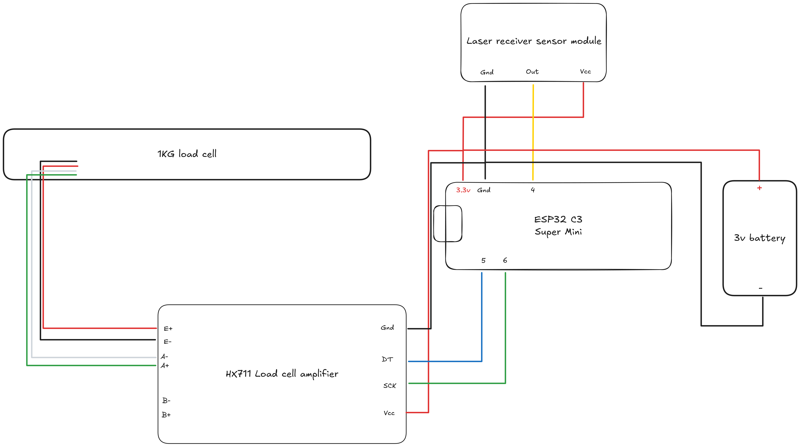

# 'Spintron' - IREC 2025 Payload -> Subsystem Spin

The software is split into 2 parts a spin subsystem and a main subsystem.
The spin subsystem is the software on the ESP 32 C3 which sends messages to the main subsystem via ESP now for the following:

1. A rotation has happened
2. A force has been collected from the load cell

Otherwise no calculations are done on this subsystem, all colleccted data is sent to the main subsystem for processing, saving, etc.

This software is built and tested using the Ardiuno IDE.

## Wiring Diagram

